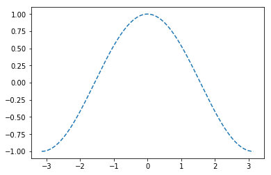

```python
from __future__ import division
```


```python
import numpy as np
```


```python
import pandas as pd
```


```python
import matplotlib as mpl
```


```python
import matplotlib.pyplot as plt
```


```python
import matplotlib.image as mping
```


```python
import jieba
```


```python
import plotly
```


```python
import plotly.plotly as py
```


```python
import seaborn as sns
```


```python
from mpl_toolkits.mplot3d import Axes3D
```


```python
from matplotlib import cm
```


```python
from matplotlib.figure import Figure
```


```python
from matplotlib.backends.backend_agg import FigureCanvasAgg as FigureCanvas
```


```python
from matplotlib.font_manager import FontProperties
```


```python
from PIL import Image
```


```python
from pandas.plotting import table
```


```python
from pandas.plotting import scatter_matrix
```


```python
from pandas.plotting import radviz
```


```python
from pandas.plotting import parallel_coordinates
```


```python
from pandas.plotting import andrews_curves
```


```python
from wordcloud import WordCloud
```


```python
from scipy.misc import imread
```


```python
from wordcloud import WordCloud
```


```python
from wordcloud import STOPWORDS
```


```python
from wordcloud import ImageColorGenerator
```


```python
def clf_cla_close(p):
    p.clf()  # 清除图像
    p.cla()  # 清除坐标
    p.close()  # 关闭图像
```


```python
# 图像中文乱码
myfont = FontProperties(fname='C:/Windows/Fonts/MSYHMONO.ttf')
```


```python
stock = np.dtype([('name', np.str_, 4), ('time', np.str_, 10), ('opening_price', np.float64), ('closing_price', np.float64), ('lowest_price', np.float64), ('highest_price', np.float64), ('volume', np.int32)])
```


```python
jd_stock = np.loadtxt('data.csv', delimiter=',', dtype=stock)
```


```python
jddf = pd.read_table('data.csv', sep=',', header=None, names=['name', 'time', 'opening_price', 'closing_price', 'lowest_price', 'highest_price', 'volume'])
```


```python
jddf['Market'] = list(map(lambda x: 'Good' if x > 0 else ('Bad' if x < 0 else 'OK'), jddf['closing_price'] - jddf['opening_price']))
```


```python
# 绘制一条从(0, 0)到(1, 1)的直线
plt.plot([0, 1], [0, 1])

# 设置图形标题
plt.title('a strait line')

# 设置x轴标签
plt.xlabel('x value')

# 设置y轴标签
plt.ylabel('y value')
```


    Text(0,0.5,'y value')


```python
# 显示图像
```


```python
plt.show()
```


```python
# clf_cla_close(plt)
```


```python
# 存储图像
# plt.savefig('Python_matplotlib.svg', bbox_inches='tight')
```


```python
# 创建多项式 (2x^4 - 3.5x^3 + 1.6x^2 - 2x + 9)
a = np.array([2, -3.5, 1.6, -2, 9])
```


```python
p = np.poly1d(a)
```


```python
p
```


    poly1d([ 2. , -3.5,  1.6, -2. ,  9. ])


```python
# 创建x轴数值 在-10~10之间产生30个服从均匀分布的随机数
x = np.linspace(-10, 10, 30)
# 利用多项式创建多项式的值
y = p(x)
# plt.plot(x, y)
plt.xlabel('X')
plt.ylabel('Y')

# p的一阶导函数
p1 = p.deriv(m=1)
y1 = p1(x)
plt.plot(x, y, x, y1)
```


    [<matplotlib.lines.Line2D at 0x191ee55e470>,
     <matplotlib.lines.Line2D at 0x191ee55e6d8>]


```python
# 'b|'表示绘制以竖线为数据点的蓝色曲线 'k-.'为黑色点线
# plt.plot(x, y, 'b| ', x, y1, 'k-.')
# plt.show()
```


```python
u = np.linspace(-3, 3, 30)
```


```python
x, y = np.meshgrid(u, u)
```


```python
r = 0.6
```


```python
mux = 0
```


```python
muy = 0
```


```python
sx = 1
```


```python
sy = 1
```


```python
z = (1 / (2 * 3.1415926535 * sx * sy * np.sqrt(1 - r * r))) * np.exp((-1 / (2 * (1 - r * r))) * (((x - mux) ** 2) / (sx ** 2) - 2 * r * (x - mux) * (y - muy) / (sx * sy) + ((y - muy) ** 2) / (sx ** 2)))
```


```python
fig = plt.figure()
```


    <Figure size 432x288 with 0 Axes>


```python
ax = fig.add_subplot(111, projection='3d')
```


```python
ax.plot_surface(x, y, z, rstride=1, cstride=1, cmap=cm.Greys)
```


    <mpl_toolkits.mplot3d.art3d.Poly3DCollection at 0x191ee5dfef0>


```python
plt.show()
```


```python
# clf_cla_close(plt)
```


```python
# 绘制随机折线图
plt.plot(np.random.randn(100), linewidth=2.0)
```


    [<matplotlib.lines.Line2D at 0x191ee63f208>]


```python
# plt.show()
# clf_cla_close(plt)
```


```python
# jd_stock
plt.plot(jd_stock['opening_price'])
```


    [<matplotlib.lines.Line2D at 0x191ee624e80>]


```python
plt.show()
```


```python
# clf_cla_close(plt)

# 图像基本设置
# 创建图例
plt.plot(jd_stock['opening_price'], label='Opening Price')
plt.plot(jd_stock['closing_price'], label='Closing Price')

# fromeon是否有框

plt.legend(loc='lower right', frameon=False)
```


    <matplotlib.legend.Legend at 0x191ee68c2b0>


```python
'''
图例标位置参数
    upper right: 1
    upper left: 2
    lower left: 3
    lower right: 4
    right: 5
    center left: 6
    center right: 7
    lower center: 8
    uppercenter: 9
    center: 10
'''
```


    '\n图例标位置参数\n    upper right: 1\n    upper left: 2\n    lower left: 3\n    lower right: 4\n    right: 5\n    center left: 6\n    center right: 7\n    lower center: 8\n    uppercenter: 9\n    center: 10\n'


```python
plt.show()
```


```python
clf_cla_close(plt)
```


```python
# 刻度设置
X = np.linspace(-np.pi, np.pi, 256, endpoint=True)
```


```python
C, S = np.cos(X), np.sin(X)
```


```python
plt.plot(X, C, '--')
```


    [<matplotlib.lines.Line2D at 0x191ee79a550>]





```python
plt.plot(X, S)

plt.xticks([-np.pi, -np.pi / 2, 0, np.pi / 2, np.pi], [r'$-\pi$', r'$-\pi/2$', r'$0$', r'$+\pi/2$', r'$+\pi$'])

plt.yticks([-1, 0, +1], [r'$-1$', r'$0$', r'$+1$'])

# 图像注解
ax = plt.gca()
```


```python
ax.spines['right'].set_color('none')
```


```python
ax.spines['top'].set_color('none')
```


```python
ax.xaxis.set_ticks_position('bottom')
```


```python
ax.spines['bottom'].set_position(('data', 0))
```


```python
ax.yaxis.set_ticks_position('left')
```


```python
ax.spines['left'].set_position(('data', 0))
```


```python
t = 2 * np.pi / 3
```


```python
plt.plot([t, t], [0, np.cos(t)], color='blue', linewidth=2.5, linestyle='--')

plt.scatter([t, ], [np.cos(t), ], 50, color='blue')

plt.annotate(r'$\sin(\frac{2\pi}{3})=\frac{\sqrt{3}}{2}$', xy=(t, np.sin(t)), xycoords='data', xytext=(+10, +30), textcoords='offset points', fontsize=16, arrowprops=dict(arrowstyle='->', connectionstyle='arc3, rad=.2'))

plt.plot([t, t], [0, np.sin(t)], color='red', linewidth=2.5, linestyle='--')

plt.scatter([t, ], [np.sin(t), ], 50, color='red')

plt.annotate(r'$\cos(\frac{2\pi}{3})=-\frac{1}{2}$', xy=(t, np.cos(t)), xycoords='data', xytext=(-90, -50), textcoords='offset points', fontsize=16, arrowprops=dict(arrowstyle='->', connectionstyle='arc3, rad=.2'))
```


    Text(-90,-50,'$\\cos(\\frac{2\\pi}{3})=-\\frac{1}{2}$')


```python
# clf_cla_close(plt)
```


```python
# 图像大小
plt.plot(jd_stock['opening_price'], label='Opening Price')

plt.plot(jd_stock['closing_price'], label='Closing Price')

plt.legend(loc='upper left', frameon=True)

plt.xticks([xticks for xticks in range(71)], list(jd_stock['time']), rotation=40)

# 设置图像对象名为fig
fig = plt.gcf()

fig.set_size_inches(18.5, 10.5)

# 显示网格
plt.grid()
```


```python
# clf_cla_close(plt)
```


```python
# 创建子图
x = np.linspace(-10, 10, 30)
y = p(x)
y = p(x)
p2 = p.deriv(m=2)
y2 = p2(x)
p3 = p.deriv(m=3)
y3 = p3(x)
plt.subplot(221)  # 2行2列第1个
plt.plot(x, y)
plt.title('Polynomial')
plt.subplot(222)
plt.plot(x, y1, 'r')
plt.title('First Derivative')
plt.subplot(223)
plt.plot(x, y2, 'r')
plt.title('Second Derivative')
plt.subplot(224)
plt.plot(x, y3, 'r')
plt.title('Third Derivative')
plt.subplots_adjust(hspace=0.4, wspace=0.3)
```


```python
clf_cla_close(plt)
```


```python
# 其他绘图函数
x = np.linspace(-10, 10, 30)
```


```python
y = p(x)
```


```python
x1 = jddf['opening_price']
```


```python
y1 = jddf['closing_price']
```


```python
plt.figure(figsize=(10, 6))

plt.subplot(231)

plt.plot(x, y)

plt.title('折线图', fontproperties=myfont)
```


    Text(0.5,1,'折线图')


```python
plt.subplot(232)

plt.scatter(x1, y1)

plt.title('散点图', fontproperties=myfont)
```


    Text(0.5,1,'散点图')


```python
plt.subplot(233)

plt.pie(y)

plt.title('饼图', fontproperties=myfont)
```


    Text(0.5,1,'饼图')


```python
plt.subplot(234)

plt.bar(x, y)

plt.title('直方图', fontproperties=myfont)
```


    Text(0.5,1,'直方图')


```python
x2 = y2 = np.arange(-5.0, 5.0, 0.005)

X, Y = np.meshgrid(x2, y2)

Z = Y + X ** 2

plt.subplot(235)

plt.contour(X, Y, Z)

plt.colorbar()

plt.title('等高线图', fontproperties=myfont)
```


    Text(0.5,1,'等高线图')


```python
img = mping.imread('logo.png')

plt.subplot(236)

plt.imshow(img)

plt.title('调用已有图片', fontproperties=myfont)

plt.subplots_adjust(hspace=0.25)
```


```python
# 面向对象绘图
```


```python
'''
fig.set_alpha(0.2 * fig.get_alpha())
fig.set(alpha=0.2, zorder=2)
# gca(): 返回当前的Axes实例本身
# gcf(): 返回当前Figure实例本身
'''
```


    '\nfig.set_alpha(0.2 * fig.get_alpha())\nfig.set(alpha=0.2, zorder=2)\n# gca(): 返回当前的Axes实例本身\n# gcf(): 返回当前Figure实例本身\n'


```python
# 防止图形叠加
fig = Figure()
canvas = FigureCanvas(fig)
```


```python
# 指定图像在子图中的位置
ax1 = fig.add_axes([0.1, 0.6, 0.2, 0.3])
```


```python
line = ax1.plot([0, 1], [0, 1])
```


```python
ax1.set_title('Axes2')
```


    Text(0.5,1,'Axes2')


```python
ax2 = fig.add_axes([0.4, 0.1, 0.4, 0.5])
```


```python
# 绘制散点图
sc = ax2.scatter(jd_stock['opening_price'], jd_stock['closing_price'])

ax2.set_title('Axes2')

sc.set(alpha=0.2, zorder=2)

# 将figure对象以指定的文件存储
canvas.print_figure('figure_line&scatter.png')

# 将所存储图片显示
Image.open('figure_line&scatter.png').show()
```


```python
# 绘图样式
# 查看所有样式
plt.style.available

plt.style.use('ggplot')

plt.plot(jd_stock['opening_price'], label='Opening Price')

plt.plot(jd_stock['closing_price'], label='Closing Price')

plt.legend(loc=8, frameon=False, bbox_to_anchor=(0.5, -0.3))
```


    <matplotlib.legend.Legend at 0x191f41b86d8>


```python
# 恢复默认风格

plt.style.use('default')
```


```python
'''
pandas基本绘图
语法:
pandas对象.plot(x=None, y=None, kind='line', ax=None, subplots=False, sharex=None, sharey=False, layout=None, figsize=None, use_index=True, title=None, grid=None, legend=True, style=None, logx=False, logy=False, loglog=False, xticks=None, colormap=None, table=False, yerr=None, xerr=None, secondary_y=False, sort_columns=False, **kwargs)
'kind'指定可绘制的图形类型:
    'line': 折线图
    'bar': 竖直条形图
    'barh': 水平条形图
    'hist': 直方图
    'box': 盒须图
    'kde': 核密度估计曲线图
    'density': 同'kde'
    'area': 面积图
    'pie': 饼图
    'scatter': 散点图
    'hexbin': 六边形箱图
其他参数:
    x: 指定x轴标签或位置
    y: 指定y轴标签或位置
    ax: matplotlib的轴对象
    subplots: True或False 是否为每列单独绘制一副图 默认把所有列绘制在一个图形中
    sharex: True或False 是否共享x轴 默认False
    sharey: True或False 是否共享y轴 默认False
    layout: 用一个元组来设计子图的布局
    figsize: 用一个元组来设置图像的尺寸
    use_index: True或False 是否使用索引作为x轴的刻度 默认False
    title: 设置图形的标题
    grid: True或False 是否设置图形网格线 默认False
    legend: True或False或reverse 放置图例
    style: 使用列表或字典分别为每一列设置matplotlib绘制线条的风格
    logx: True或False 将x轴对数化 默认False
    logy: True或False 将y轴对数化 默认False
    loglog: True或False 将x轴和y轴同时对数化 默认False
    xticks: 使用一个序列设置x轴的刻度
    yticks: 使用一个序列设置y轴的刻度
    xlim: 使用2个元素的元组/列表设置x的上下界
    ylim: 使用2个元素的元组/列表设置y的上下界
    rot: 使用一个整数来设置刻度的旋转方向
    fontsize: 使用一个整数来设置x轴和y轴刻度的字号
    colormap: 设置图像的色系
    colorbar: True或False 如设置True 则绘制colorbar
    position: 用一个浮点数来设置图形的相对位置 取值从0到1 默认值为0.5
    table: True或False 设置图形中是否绘制统计表
    yerr和xerr: True或False 绘制残差图
    stacked: True或False 绘制堆积图形
    sort_columns: True或False 对图形列的名称进行排序放置 默认False
    secondary_y: True或False 是否放置第2个y轴 默认不放置
    mark_right: True或False 当使用第2个y轴时 自动在图例中标记为right 默认False
    kwds: 选项关键字
'''
```


    "\npandas基本绘图\n语法:\npandas对象.plot(x=None, y=None, kind='line', ax=None, subplots=False, sharex=None, sharey=False, layout=None, figsize=None, use_index=True, title=None, grid=None, legend=True, style=None, logx=False, logy=False, loglog=False, xticks=None, colormap=None, table=False, yerr=None, xerr=None, secondary_y=False, sort_columns=False, **kwargs)\n'kind'指定可绘制的图形类型:\n    'line': 折线图\n    'bar': 竖直条形图\n    'barh': 水平条形图\n    'hist': 直方图\n    'box': 盒须图\n    'kde': 核密度估计曲线图\n    'density': 同'kde'\n    'area': 面积图\n    'pie': 饼图\n    'scatter': 散点图\n    'hexbin': 六边形箱图\n其他参数:\n    x: 指定x轴标签或位置\n    y: 指定y轴标签或位置\n    ax: matplotlib的轴对象\n    subplots: True或False 是否为每列单独绘制一副图 默认把所有列绘制在一个图形中\n    sharex: True或False 是否共享x轴 默认False\n    sharey: True或False 是否共享y轴 默认False\n    layout: 用一个元组来设计子图的布局\n    figsize: 用一个元组来设置图像的尺寸\n    use_index: True或False 是否使用索引作为x轴的刻度 默认False\n    title: 设置图形的标题\n    grid: True或False 是否设置图形网格线 默认False\n    legend: True或False或reverse 放置图例\n    style: 使用列表或字典分别为每一列设置matplotlib绘制线条的风格\n    logx: True或False 将x轴对数化 默认False\n    logy: True或False 将y轴对数化 默认False\n    loglog: True或False 将x轴和y轴同时对数化 默认False\n    xticks: 使用一个序列设置x轴的刻度\n    yticks: 使用一个序列设置y轴的刻度\n    xlim: 使用2个元素的元组/列表设置x的上下界\n    ylim: 使用2个元素的元组/列表设置y的上下界\n    rot: 使用一个整数来设置刻度的旋转方向\n    fontsize: 使用一个整数来设置x轴和y轴刻度的字号\n    colormap: 设置图像的色系\n    colorbar: True或False 如设置True 则绘制colorbar\n    position: 用一个浮点数来设置图形的相对位置 取值从0到1 默认值为0.5\n    table: True或False 设置图形中是否绘制统计表\n    yerr和xerr: True或False 绘制残差图\n    stacked: True或False 绘制堆积图形\n    sort_columns: True或False 对图形列的名称进行排序放置 默认False\n    secondary_y: True或False 是否放置第2个y轴 默认不放置\n    mark_right: True或False 当使用第2个y轴时 自动在图例中标记为right 默认False\n    kwds: 选项关键字\n"


```python
# 基本统计图形
# 折线图
plt.plot(jddf['opening_price'])

# 计算开盘价的5期移动平均
meanop = jddf['opening_price'].rolling(5).mean()

stdop = jddf['opening_price'].rolling(5).std()

plt.plot(range(71), jddf['opening_price'])

plt.fill_between(range(71), meanop - 1.96 * stdop, meanop + 1.96 * stdop, color='b', alpha=0.2)
```


    <matplotlib.collections.PolyCollection at 0x191f5863fd0>


```python
# pandas的plot方法绘图
jddf = jddf.set_index('time')
```


```python
jddf[['opening_price', 'closing_price']].plot(use_index=True, grid=True)
```


    <matplotlib.axes._subplots.AxesSubplot at 0x191f59e3940>


```python
# pandas的plot方法绘制第2个y轴
jddf['closing_price'].plot(use_index=True, grid=True)

jddf['volume'].plot(use_index=True, secondary_y=True, grid=True)
```


    <matplotlib.axes._subplots.AxesSubplot at 0x191f5952b70>


```python
# 绘制自带统计量图
fig, ax = plt.subplots(1, 1)

table(ax, np.round(jddf[['opening_price', 'closing_price']].describe(), 2), loc='upper right', colWidths=[0.2, 0.2])

jddf.plot(ax=ax, ylim=(25, 45))

plt.legend(loc='upper left', frameon=False)

fig.set_size_inches(9, 6)
```


```python
# 面积图
jddf[['opening_price', 'closing_price', 'highest_price', 'lowest_price']].plot.area(ylim=(25, 35), stacked=False, cmap='tab10_r')
```


    <matplotlib.axes._subplots.AxesSubplot at 0x191f5a5dcc0>


```python
# 直方图
# 参数: 待绘制的定量数据 划分区间个数
plt.hist(jddf['opening_price'], 10)

plt.xlabel('Opening Price')

plt.ylabel('Frequency')

plt.title('Opening Price of JD Stock')
```


    Text(0.5,1,'Opening Price of JD Stock')


```python
# pandas对象使用hist和plot方法绘制直方图

jddf['opening_price'].hist()

clf_cla_close(plt)

jddf[['opening_price', 'closing_price']].plot(kind='hist', alpha=0.5, colormap='tab10_r', bins=8)

plt.legend(loc=8, frameon=False, bbox_to_anchor=(0.5, -0.3))
```


    <matplotlib.legend.Legend at 0x191efe5c940>


```python
# 利用hist方法中的by参数指定分类变量按照其分类分别绘制图形
jddf[['opening_price', 'closing_price']].hist(by=jddf['Market'], stacked=True, bins=8, color=['gray', 'lightblue'])
```


    array([[<matplotlib.axes._subplots.AxesSubplot object at 0x00000191EFAFA898>,
            <matplotlib.axes._subplots.AxesSubplot object at 0x00000191EFAA2F98>],
           [<matplotlib.axes._subplots.AxesSubplot object at 0x00000191EFE0A668>,
            <matplotlib.axes._subplots.AxesSubplot object at 0x00000191EF9C1CF8>]],
          dtype=object)


```python
# 条形图
N = 5
menMeans = (20, 35, 30, 35, 27)
womenMeans = (25, 32, 34, 20, 25)
menStd = (2, 3, 4, 1, 2)
womenStd = (3, 5, 2, 3, 3)
ind = np.arange(N)
width = 0.45
p1 = plt.bar(ind, menMeans, width, color='grey', yerr=menStd)
p2 = plt.bar(ind, womenMeans, width, color='lightblue', bottom=menMeans, yerr=womenStd)
```


```python
# 数据集
salary_fmt = np.dtype([('position', np.str_, 8), ('id', np.int32), ('gender', np.str_, 1), ('education', np.int32), ('salary', np.float64), ('begin_salary', np.float64), ('jobtime', np.int32), ('age', np.int32)])
salary = pd.DataFrame(np.loadtxt('salary.csv', delimiter=',', skiprows=1, dtype=salary_fmt))
salary.head()
```


<div>
<style scoped>
    .dataframe tbody tr th:only-of-type {
        vertical-align: middle;
    }

    .dataframe tbody tr th {
        vertical-align: top;
    }

    .dataframe thead th {
        text-align: right;
    }
</style>
<table border="1" class="dataframe">
  <thead>
    <tr style="text-align: right;">
      <th></th>
      <th>position</th>
      <th>id</th>
      <th>gender</th>
      <th>education</th>
      <th>salary</th>
      <th>begin_salary</th>
      <th>jobtime</th>
      <th>age</th>
    </tr>
  </thead>
  <tbody>
    <tr>
      <th>0</th>
      <td>employee</td>
      <td>412</td>
      <td>0</td>
      <td>12</td>
      <td>22800.0</td>
      <td>11250.0</td>
      <td>68</td>
      <td>36</td>
    </tr>
    <tr>
      <th>1</th>
      <td>employee</td>
      <td>403</td>
      <td>0</td>
      <td>12</td>
      <td>21300.0</td>
      <td>11250.0</td>
      <td>69</td>
      <td>36</td>
    </tr>
    <tr>
      <th>2</th>
      <td>employee</td>
      <td>398</td>
      <td>0</td>
      <td>12</td>
      <td>30600.0</td>
      <td>12450.0</td>
      <td>69</td>
      <td>36</td>
    </tr>
    <tr>
      <th>3</th>
      <td>employee</td>
      <td>392</td>
      <td>0</td>
      <td>12</td>
      <td>21600.0</td>
      <td>12000.0</td>
      <td>69</td>
      <td>36</td>
    </tr>
    <tr>
      <th>4</th>
      <td>employee</td>
      <td>396</td>
      <td>0</td>
      <td>12</td>
      <td>20850.0</td>
      <td>11250.0</td>
      <td>69</td>
      <td>36</td>
    </tr>
  </tbody>
</table>
</div>


```python
# 绘制不同职位人员分布的条形图
# 创建一个字典 对职称的每一个类型进行频数统计
gradeGroup = {}

for grade in salary['position']:
    gradeGroup[grade] = gradeGroup.get(grade, 0) + 1

xt = gradeGroup.keys()

xv = gradeGroup.values()
# bar函数创建条形图
# #1: 柱的横坐标 #2: 柱的高度 align: 条或柱的对齐方式
plt.bar(range(3), [gradeGroup.get(xticks, 0) for xticks in xt], align='center', color='lightblue')

# 设置条或柱的文字说明
# 1#: 文字说明的横坐标 #2: 文字说明内容 #3: 设置排列方向
plt.xticks((0, 1, 2), xt, rotation='horizontal')

plt.xlabel('position')

plt.ylabel('frequency')

plt.title('job position')

def autolabel(rects):
    # 为条形图中的条挂上数据标签
    i = -1
    for rect in rects:
        i += 1
        # 1, 2#: 数据值标签在x, y轴上的坐标 3#: 数据值标签
        plt.text(i, rect - 10, '%d' % rect, ha='center', va='bottom')

autolabel(xv)
```


```python
# 分类对比条形图
plt.figure()

count_f = [206, 0, 10]

count_m = [-157, -71, -27]

plt.barh(range(3), count_f, color='r', alpha=.5, label='female')

plt.barh(range(3), count_m, color='b', alpha=.5, label='male')

plt.yticks(range(3), xt)

plt.legend(loc=1)

plt.axvline(0, color='k')
```


    <matplotlib.lines.Line2D at 0x191f00e5a90>


```python
# pandas绘制
salary['position'].value_counts().plot.bar(rot=0, colormap='summer')

clf_cla_close(plt)

crosssalary = pd.crosstab(salary['position'], salary['gender'])

crosssalary.columns = ['female', 'male']

crosssalary.plot.bar(rot=0, colormap='autumn', stacked=True)
```


    <matplotlib.axes._subplots.AxesSubplot at 0x191f556ae80>


```python
# 龙卷风图
yt = ('student', 'employee', 'worker', 'manager', 'lawyer', 'driver', 'fireman', 'singer', 'composer', 'professor', 'journalist')

count_f = [78, 70, 90, 110, 80, 110, 150, 120, 196, 180, 220]

count_m = [-10, -21, -27, -34, -89, -84, -78, -90, -100, -123, -212]

plt.barh(range(11), count_f, color='r', alpha=.5, label='female')

plt.barh(range(11), count_m, color='b', alpha=.5, label='male')

plt.yticks(range(11), yt)

plt.xticks([-150, 150], ['male', 'female'])
```


    ([<matplotlib.axis.XTick at 0x191f55f0f28>,
      <matplotlib.axis.XTick at 0x191f55f08d0>],
     <a list of 2 Text xticklabel objects>)


```python
# 饼图
sizes = {}
total = sum(gradeGroup.values())
explode = (0, 0.3, 0)
colors = ['yellowgreen', 'gold', 'lightskyblue']

for i in xt:
    sizes[i] = gradeGroup[i] / total

plt.pie(sizes.values(), labels=sizes.keys(), explode=explode, autopct='%1.2f%%', colors=colors, shadow=True, startangle=45)
```


    ([<matplotlib.patches.Wedge at 0x191f5696080>,
      <matplotlib.patches.Wedge at 0x191f5696a20>,
      <matplotlib.patches.Wedge at 0x191f56e04e0>],
     [Text(-1.09767,-0.0714858,'employee'),
      Text(1.39074,-0.160727,'manager'),
      Text(0.90456,0.625916,'director')],
     [Text(-0.598732,-0.0389923,'77.07%'),
      Text(0.894049,-0.103324,'17.20%'),
      Text(0.493397,0.341409,'5.73%')])


```python
# pandas饼图
piedf = pd.DataFrame({'percent of position': [0.7707, 0.0573, 0.17201]}, index=['employee', 'director', 'manager'])
piedf['percent of position'].plot.pie(colors=colors, labeldistance=0.85, autopct='%1.2f%%', fontsize=12, explode=explode, startangle=45)
piedf['percent of position'].plot(kind='pie', labeldistance=0.85, colors=colors, autopct='%1.2f%%', fontsize=12, explode=explode, startangle=45)
```


    <matplotlib.axes._subplots.AxesSubplot at 0x191f56f8eb8>


```python
# 阶梯图
# 1#: 绘制的定量数据 2#: 划分的区间数 density: 参数是否无量纲化 histtype: 绘制阶梯状曲线
plt.hist(salary['salary'], 10, density=True, histtype='step', cumulative=True)

plt.xlabel('current salary')

plt.ylabel('frequency')

plt.title('salary of U.S. enterpriceses')
```


    Text(0.5,1,'salary of U.S. enterpriceses')


```python
# pandas阶梯图
salary['salary'].plot.hist(bins=10, density=True, histtype='step', cumulative=True)

plt.xlabel('current salary')

plt.ylabel('frequency')

plt.title('salary of U.S. enterpriceses')
```


    Text(0.5,1,'salary of U.S. enterpriceses')


```python
# 盒须图
# 1#: 数据 2#: 盒子形状 0默认矩形 1凹型 3#: 异常值数据标志形状 4#: 绘制水平盒须图
plt.boxplot(salary['salary'], 1, 'r', 0, labels=['current salary'])

plt.title('salary of U.S. enterpriceses')
```


    Text(0.5,1,'salary of U.S. enterpriceses')


```python
plt.boxplot([salary['salary'], salary['begin_salary']])

plt.title('salary of U.S. enterpriceses')

combinebox = plt.subplot(111)

combinebox.set_xticklabels(['current salary', 'begin_salary'])
```

    c:\program files\python36\lib\site-packages\matplotlib\cbook\deprecation.py:107: MatplotlibDeprecationWarning:
    
    Adding an axes using the same arguments as a previous axes currently reuses the earlier instance.  In a future version, a new instance will always be created and returned.  Meanwhile, this warning can be suppressed, and the future behavior ensured, by passing a unique label to each axes instance.
    
    


    [Text(0,0,'current salary'), Text(0,0,'begin_salary')]


```python
jd_box_data = [jd_stock['opening_price'], jd_stock['closing_price'], jd_stock['highest_price'], jd_stock['lowest_price']]

bplot = plt.boxplot(jd_box_data, vert=True, patch_artist=True)

# 盒子上色
colors = ['pink', 'lightblue', 'lightgreen', 'cyan']

for patch, color in zip(bplot['boxes'], colors):
    patch.set_facecolor(color)

combinebox = plt.subplot(111)

combinebox.set_xticklabels(['opening_price', 'closing_price', 'highest_price', 'lowest_price'])
```

    c:\program files\python36\lib\site-packages\matplotlib\cbook\deprecation.py:107: MatplotlibDeprecationWarning:
    
    Adding an axes using the same arguments as a previous axes currently reuses the earlier instance.  In a future version, a new instance will always be created and returned.  Meanwhile, this warning can be suppressed, and the future behavior ensured, by passing a unique label to each axes instance.
    
    


    [Text(0,0,'opening_price'),
     Text(0,0,'closing_price'),
     Text(0,0,'highest_price'),
     Text(0,0,'lowest_price')]


```python
colors = dict(boxes='lightgreen', whiskers='lightblue', medians='lightgreen', caps='cyan')

bplot = jddf[['opening_price', 'closing_price', 'highest_price', 'lowest_price']].plot.box(color=colors, vert=False, positions=[1, 3, 4, 8], patch_artist=True)
```


```python
# 小提琴图
axex = plt.subplots(nrows=1, ncols=1, figsize=(8, 5))

vplot = plt.violinplot(jd_box_data, showmeans=False, showmedians=True)

colors = ['pink', 'lightblue', 'lightgreen', 'yellow']

for patch, color in zip(vplot['bodies'], colors):
    patch.set_facecolor(color)

plt.grid(True)

plt.xticks([1, 2, 3, 4], ['opening_price', 'closing_price', 'highest_price', 'lowest_price'])
```


    ([<matplotlib.axis.XTick at 0x191f8c2ddd8>,
      <matplotlib.axis.XTick at 0x191f8c2d710>,
      <matplotlib.axis.XTick at 0x191f8c2d470>,
      <matplotlib.axis.XTick at 0x191f8c5e4e0>],
     <a list of 4 Text xticklabel objects>)


```python
# 散点图
plt.scatter(salary['salary'], salary['begin_salary'], c='darkblue', alpha=0.4)

plt.xlabel('current salary')

plt.ylabel('begin_salary')
```


    Text(0,0.5,'begin_salary')


```python
# pandas绘制散点图
salary.plot.scatter(x='salary', y='begin_salary', c='cyan', alpha=0.45)
```


    <matplotlib.axes._subplots.AxesSubplot at 0x191f8de4fd0>


```python
# 叠加散点图
sc1 = jddf.plot.scatter(x='opening_price', y='closing_price', c='blue', label='opening & closing')
```


```python
# ax#: 把指定的scl绘图对象叠加到本次所绘的图形中
jddf.plot.scatter(x='highest_price', y='lowest_price', c='red', label='highest & lowest', ax=sc1)
```


    <matplotlib.axes._subplots.AxesSubplot at 0x191f8e5c320>


```python
# c#: 使用其他变量标注散点
jddf.plot.scatter(x='opening_price', y='closing_price', cmap='Blues_r', c='volume', grid=True)
```


    <matplotlib.axes._subplots.AxesSubplot at 0x191f8ea2be0>


```python
# 散点图矩阵
scatter_matrix(jddf[['opening_price', 'closing_price', 'highest_price', 'lowest_price']], alpha=0.5, figsize=(9, 9), diagonal='kde')
```


    array([[<matplotlib.axes._subplots.AxesSubplot object at 0x00000191F9097FD0>,
            <matplotlib.axes._subplots.AxesSubplot object at 0x00000191F90DFF28>,
            <matplotlib.axes._subplots.AxesSubplot object at 0x00000191F91105F8>,
            <matplotlib.axes._subplots.AxesSubplot object at 0x00000191F9138C88>],
           [<matplotlib.axes._subplots.AxesSubplot object at 0x00000191F9169358>,
            <matplotlib.axes._subplots.AxesSubplot object at 0x00000191F9169390>,
            <matplotlib.axes._subplots.AxesSubplot object at 0x00000191F91C50B8>,
            <matplotlib.axes._subplots.AxesSubplot object at 0x00000191FA1BC748>],
           [<matplotlib.axes._subplots.AxesSubplot object at 0x00000191FA1E7DA0>,
            <matplotlib.axes._subplots.AxesSubplot object at 0x00000191FA215470>,
            <matplotlib.axes._subplots.AxesSubplot object at 0x00000191FA23DB00>,
            <matplotlib.axes._subplots.AxesSubplot object at 0x00000191FA26F1D0>],
           [<matplotlib.axes._subplots.AxesSubplot object at 0x00000191FA298860>,
            <matplotlib.axes._subplots.AxesSubplot object at 0x00000191FA2BFEF0>,
            <matplotlib.axes._subplots.AxesSubplot object at 0x00000191FA2F25C0>,
            <matplotlib.axes._subplots.AxesSubplot object at 0x00000191FA31BC50>]],
          dtype=object)


```python
# 概率密度曲线图
jddf['opening_price'].plot(kind='kde')
```


    <matplotlib.axes._subplots.AxesSubplot at 0x191f8e09630>


```python
# 气泡图(散点图延伸 气泡越大数值越大)
colors = np.random.rand(71)
plt.scatter(jd_stock['opening_price'], jd_stock['closing_price'], marker='o', c=colors, s=jd_stock['volume'] / 10000, alpha=0.6)
plt.xlabel('opening_price', fontsize=12)
plt.ylabel('closing_price', fontsize=12)
```


    Text(0,0.5,'closing_price')


```python
# 六边形箱图(蜂窝图)
# pandas绘图
# gridsize#: x轴方向分箱数目 默认100
salary.plot.hexbin(x='salary', y='begin_salary', gridsize=25)
```


    <matplotlib.axes._subplots.AxesSubplot at 0x191fa676470>


```python
# 描述类似气泡图的散点值
salary.plot.hexbin(x='salary', y='begin_salary', C='age', reduce_C_function=np.min, gridsize=25)
```


    <matplotlib.axes._subplots.AxesSubplot at 0x191fa582da0>


```python
# 雷达坐标图(属性图)
fig = plt.figure()
```


    <Figure size 640x480 with 0 Axes>


```python
# 1#: 要分析对象 2#: 分类变量
radviz(salary[['salary', 'begin_salary', 'age', 'education', 'jobtime', 'position']], 'position')
```


    <matplotlib.axes._subplots.AxesSubplot at 0x191fa63e0b8>


```python
# 轮廓图(横坐标表示需要分析的变量 纵坐标各个指标的值)
# 1#: 要分析对象 2#: 分类变量
parallel_coordinates(salary[['salary', 'begin_salary', 'jobtime', 'position']], 'position')
```


    <matplotlib.axes._subplots.AxesSubplot at 0x191fa616278>


```python
# 调和曲线图(根据三角变换方法将高维空间上的点映射到二维平面的曲线上)
andrews_curves(salary[['salary', 'begin_salary', 'jobtime', 'position']], 'position')
```


    <matplotlib.axes._subplots.AxesSubplot at 0x191fc12c390>


```python
# 等高线图
u = np.linspace(-3, 3, 30)

x, y = np.meshgrid(u, u)

r = 0.6
mux = 0
muy = 0
sx = 1
sy = 1
z = (1 / (2 * 3.1415926535 * sx * sy * np.sqrt(1 - r * r))) * np.exp((-1 / (2 * (1 - r * r))) * (((x - mux) ** 2) / (sx ** 2) - 2 * r * (x - mux) * (y - muy) / (sx * sy) + ((y - muy) ** 2) / (sx ** 2)))

plt.contourf(x, y, z, alpha=.35, cmap=cm.gist_earth)
C = plt.contour(x, y, z, colors='black', linewidth=.5)
plt.clabel(C, inline=1, fontsize=10)
```

    c:\program files\python36\lib\site-packages\matplotlib\contour.py:960: UserWarning:
    
    The following kwargs were not used by contour: 'linewidth'
    
    


    <a list of 7 text.Text objects>


```python
# 极坐标图
N = 150

r = 2 * np.random.rand(N)

theta = 2 * np.pi * np.random.rand(N)
area = 200 * r ** 2 * np.random.rand(N)
colors = theta
ax = plt.subplot(111, projection='polar')
c = plt.scatter(theta, r, c=colors, s=area, cmap=plt.cm.hsv)
c.set_alpha(0.75)
```


```python
# 词云图
s = pd.read_csv('zhuxian.csv', encoding='utf8')
s.head()

# 指定用于制图的文本
mylist = s['chapter1']
word_list = [' '.join(jieba.cut(sentence)) for sentence in mylist]

# 将所有文本字符链接起来
new_text = ' '.join(word_list)

# 设置词云图的字体 背景颜色 最大词频
wordcloud = WordCloud(font_path='C:/Windows/Fonts/MSYHMONO.ttf', background_color='white', width=2000, height=1000, max_words=200).generate(new_text)
plt.imshow(wordcloud)
plt.axis('off')
```

    Building prefix dict from the default dictionary ...
    Loading model from cache C:\Users\PANGDA~1\AppData\Local\Temp\jieba.cache
    Loading model cost 1.331 seconds.
    Prefix dict has been built succesfully.
    


    (-0.5, 1999.5, 999.5, -0.5)


```python
wordtxt = pd.read_table('cuebintro.txt', encoding='utf8', names=['introduction'])
mylist = wordtxt['introduction']
word_list = [' '.join(jieba.cut(sentence)) for sentence in mylist]
new_text = ' '.join(word_list)
coloring = imread('logo.png')
stw = STOPWORDS.copy()
stw.add('人')
stw.add('的')
stw.add('等')
wordcloud = WordCloud(font_path='C:/Windows/Fonts/MSYHMONO.ttf', background_color='white', max_font_size=180, scale=2, width=1800, height=800, mask=coloring, stopwords=stw, random_state=42).generate(new_text)

image_colors = ImageColorGenerator(coloring)

plt.imshow(wordcloud)

plt.axis('off')

plt.figure()

wordcloud.to_file('cuebcloud.png')
```

    <wordcloud.wordcloud.WordCloud at 0x191ff56e8d0>


    <Figure size 640x480 with 0 Axes>


```python
# 数据地图
df = pd.read_csv('chinacitypop.csv', encoding='utf8')
df.head()
plotly.tools.set_credentials_file(username='xxxxxxx', api_key='xxxxxxxxxx')
df['text'] = df['name'] + '<bf>Population' + (df['pop']).astype(str) + 'ten thousand'
limits = [(0, 2), (3, 10), (11, 100), (101, 200), (201, 350)]
colors = ['rgb(0, 116, 217)', 'rgb(255, 65, 54)', 'rgb(133, 20, 75)', 'rgb(255, 133, 27)', 'lightgrey']
cities = []
scale = 10
for i in range(len(limits)):
    lim = limits[i]
    df_sub = df[lim[0]:lim[1]]
    city = dict(type='scattergeo', locationmode='China', lon=df_sub['lon'], lat=df_sub['lat'], text=df_sub['text'], marker=dict(size=df_sub['pop'] / scale, color=colors[i], line=dict(width=0.5, color='rgb(40, 40, 40)'), sizemode='area'), name='{0}-{1}'.format(lim[0], lim[1]))
    cities.append(city)
layout = dict(title='2014 China city population<br>(Click legend to toggle traces)', showlegend=True, geo=dict(scope='asia', projection=dict(type='mercator'), showland=True, landcolor='rgb(217, 217, 217)', subunitwidth=1, countrywidth=1, subunitcolor='rgb(255, 255, 255', countrycolor='rgb(255, 255, 255)'),)
fig = dict(data=cities, layout=layout)

py.iplot(fig, filename='d3-bubble-map-chn-populations')
```


<iframe id="igraph" scrolling="no" style="border:none;" seamless="seamless" src="https://plot.ly/~pangdahai/0.embed" height="525px" width="100%"></iframe>


```python
# 其它绘图工具
with sns.axes_style('dark'):
    sns.jointplot(salary['salary'], salary['begin_salary'], kind='hex')
```


